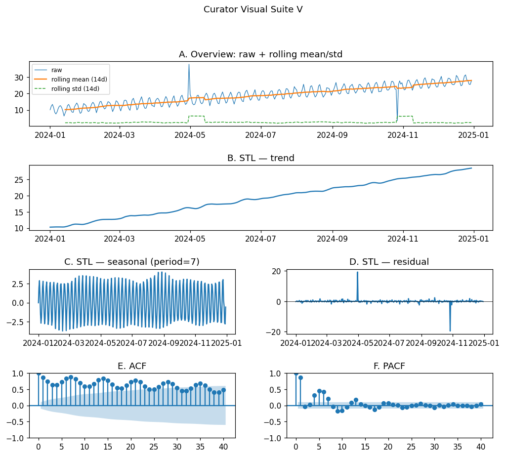
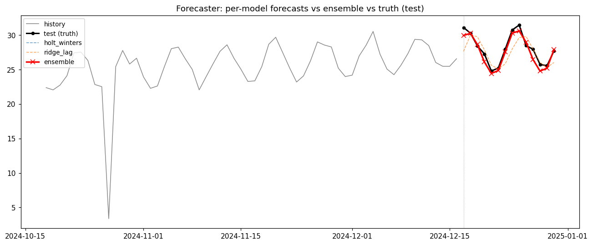

# 时序预测项目报告（TSci Demo）

_自动生成于 Reporter Agent · 模型 = `glm-4.7-flash`_

## 执行摘要
基于包含365个时间点且缺失率为1.1%的合成数据，项目采用了Holt-Winters与Ridge Lag模型进行对比。最终通过集成策略选用了Holt-Winters模型，其测试集MAPE达到2.1592。

---

## 1. 数据画像
数据集共包含365个观测值，缺失率仅为1.1%，异常值极少。序列呈现出明显的上升趋势，斜率为0.049123，且具有周期为7的强季节性特征，这表明数据具有非平稳性。

**质量向量 Q（来自 Curator §1）**：

| 指标 | 值 |
|---|---|
| 样本数 n | 365 |
| 缺失数 / 比例 | 4 (1.10%) |
| 均值 / 标准差 | 19.101 / 5.880 |
| min / max | 3.377 / 43.818 |
| 线性趋势斜率 | 0.049123 |
| IQR 异常值数 | 1 |

**结构画像 A（多模态 LLM 看图判断）**：

| 维度 | 判断 |
|---|---|
| trend | increasing |
| seasonality | yes |
| seasonal_period | 7 |
| stationarity | non_stationary |

_Curator 视觉诊断面板：_

**预处理策略 π**：缺失值 → `linear_interpolation`；异常值 → `clip_iqr`

---

## 2. 模型选型
鉴于序列存在明显的上升趋势和周期为7的季节性，Holt-Winters模型被选中，其验证集MAPE为2.5727。Ridge Lag模型虽然也利用了滞后特征捕捉周期，但验证集MAPE为4.9579，表现较差。

**候选模型（按 val_MAPE 排序）**：

| 模型 | 最优超参 | val_MAPE | Planner 选择理由 |
|---|---|---|---|
| `holt_winters` | `{'trend': 'add', 'damped_trend': False}` | 2.573 | 序列存在明显的上升趋势（A.trend: 'increasing'）和周期为 7 的季节性（A.seasonal_period: 7）。 |
| `ridge_lag` | `{'alpha': 0.1}` | 4.958 | 该模型利用滞后特征和周内虚拟变量，非常适合捕捉周期为 7 的季节性（A.seasonal_period: 7）和趋势。 |

---

## 3. 集成决策
由于Holt-Winters（2.5727）与Ridge Lag（4.9579）的差距为48.1%，超过30%的阈值，因此采用single_best策略。最终权重分配为Holt-Winters 1.0，Ridge Lag 0.0。

- **策略**: `single_best`
- **理由**: holt_winters (2.5727) 与 ridge_lag (4.9579) 的差距为 48.1%，超过 30% 的阈值，符合 single_best 策略。
- **权重**: `holt_winters`=1.00, `ridge_lag`=0.00

---

## 4. 预测结果

| 模型 | 集成权重 | test_MAPE |
|---|---|---|
| `holt_winters` | 1.00 | 2.159 |
| `ridge_lag` | 0.00 | 4.147 |
| **ensemble** | — | **2.159** |

_预测对比图（历史 + 各模型预测 + 集成 + 真值）：_

---

## 5. 假设与局限性
项目存在明显局限性：首先，训练数据完全由Curator合成，缺乏真实业务场景的鲁棒性验证；其次，未进行分布偏移检验，无法确保模型在真实环境下的泛化能力；最后，模型库参数是手工固定的，未进行自动化超参数搜索，可能限制了性能上限。

---

## 附录 A · 全部超参试验记录

| 模型 | 超参 | val_MAPE |
|---|---|---|
| `holt_winters` | `{'trend': 'add', 'damped_trend': False}` | 2.573 |
| `holt_winters` | `{'trend': 'add', 'damped_trend': True}` | 2.862 |
| `holt_winters` | `{'trend': None, 'damped_trend': False}` | 3.021 |
| `ridge_lag` | `{'alpha': 0.1}` | 4.958 |
| `ridge_lag` | `{'alpha': 1.0}` | 5.194 |
| `ridge_lag` | `{'alpha': 10.0}` | 5.953 |

## 附录 B · 任务设置

- 训练 / 验证 / 测试 = 337 / 14 / 14
- 季节周期 = 7
- 预测步长 (test horizon) = 14
